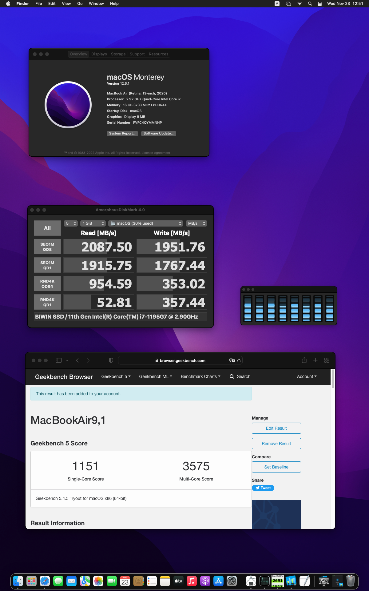
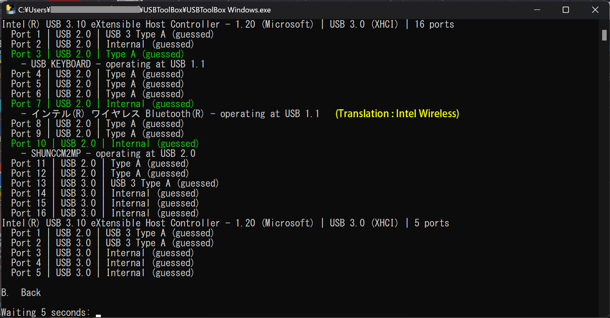

# GPD Pocket 3 hackintosh configurations

## Overview
This is a bare minimum configuration set for GPD Pocket 3 to boot some OS.

## Boot environment
* OpenCore 0.8.5

## Status
### Works
* Internal NVMe
* Keybord
* Touchpad, mouse cursor only
* WiFi
* Ethernet port
* Bluetooth
* USB
* Camera (works as generic USB camera)

### Seems to work but not tested
* Serial port - the port is recognized by OS

### Not Works
As Iris Xe GPU in the 11th Gen CPU is not supported by OS, GPU functionalities do not work.

* METAL
* HDMI out
* Screen orientation (too bad)

### Not tried for post-installation configurations
* Touch screen
* Touchpad with multi-touch
* Audio
* Thunderbolt
* LCD brightness control with keyboard Fn buttons

## Installation
### BIOS configurations
See [BIOS Configurations](BIOS_config/README.md)

### ACPI
These SSDTs must be required to boot.

* SSDT-EC-USBX.aml
* SSDT-RHUB.aml

### Kexts
`UTBMap.kext` with `USBToolBox.kext` should be needed to boot from an USB stick. Without those proper USB port limit map, only the USB port on the module slot works.
 
### config.plist
System Serial Number in config.plist is empty. You need define proper number.

As 11th Gen CPU is not supported by OS, CPU ID spoofing is needed. See `Kernel -> Emulate` configuration.

## Appendix
### USB ports map

#### Port map of XHCI 16 ports

Port | Where | USB version
--- | --- | ---
Port 1 | Type C | 2.0
Port 3 | Internal keyboard | 1.1
Port 4 | Right side back USB Type A | 2.0
Port 5 | Right side front USB Type A | 2.0
Port 6 | USB Type A module | 2.0
Port 7 | Internal Bluetooth | 1.1
Port 10 | Internal camera | 2.0
Poet 13 | Right side front USB Type A | 3.0
port 14 | USB Type A module | 3.0
Port 16 | Right side back USB Type A | 3.0

#### Port map of XHCI 5 ports
Port | Where | USB version
--- | --- | ---
Port 2 | Type C | 3.0

### DSDT
[DSDT](DSDT) directory contains DSDT data which was dumped by OpenCore. It also contains CPU and PCI info.

### HW info which captured on Ubuntu
[HW_info_Ubuntu](HW_info_Ubuntu) directory contains HW info which captured on Ubuntu.
